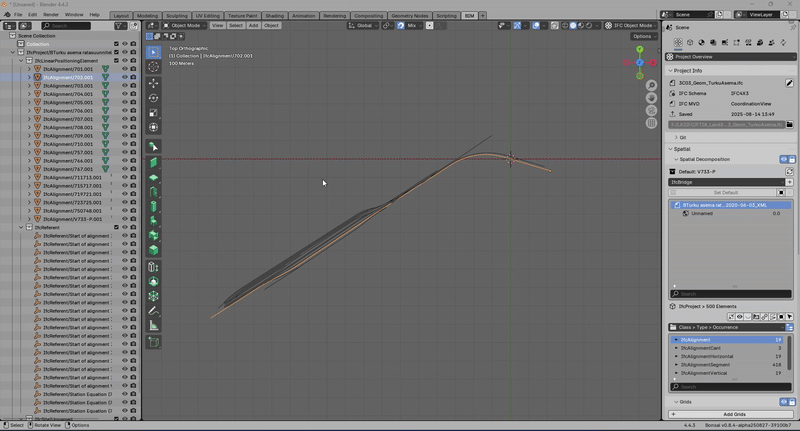

# Alignment Profile Plot

This is an experimental addon intended to explore a method of displaying vertical profile and cant deviating elevations for alignments in Bonsai.

## Requiremments
To use it, [BonsaiBIM](https://extensions.blender.org/add-ons/bonsai/) must be installed on your system.

## Installation:
- Download a release .zip file,
- goto the `Preferences` menu in Blender,
- select `Add-ons`, and then click on the `Install From Disk...` button.
- Navigate to the folder where you downloaded the addon and select the zip file. After installation, enable the addon by checking the checkbox next to its name.

## Usage:
1. Load an IFC 4x3 file into Bonsai which contains alignments.
2. Select an alignment instance in the 3D view.
3. Open an Image Editor window and select the 'Alignment Profile' node.

Hope this is useful to you!
Open to ideas for improvement.
Pull requests are welcome!

## Support:

Please support [Dion](https://github.com/Moult) and [athoms](https://github.com/aothms), to continue their earth-shattering work.  
- [IfcOpenShell](https://github.com/IfcOpenShell/IfcOpenShell)
- [BonsaiBIM](https://github.com/Bonsai-Blender/BonsaiBIM)

## License
LGPL 3

## Acknowledgement

The idea for this addin comes from [BonsaiGraph](https://github.com/jakob-beetz/bonsaiGraph).